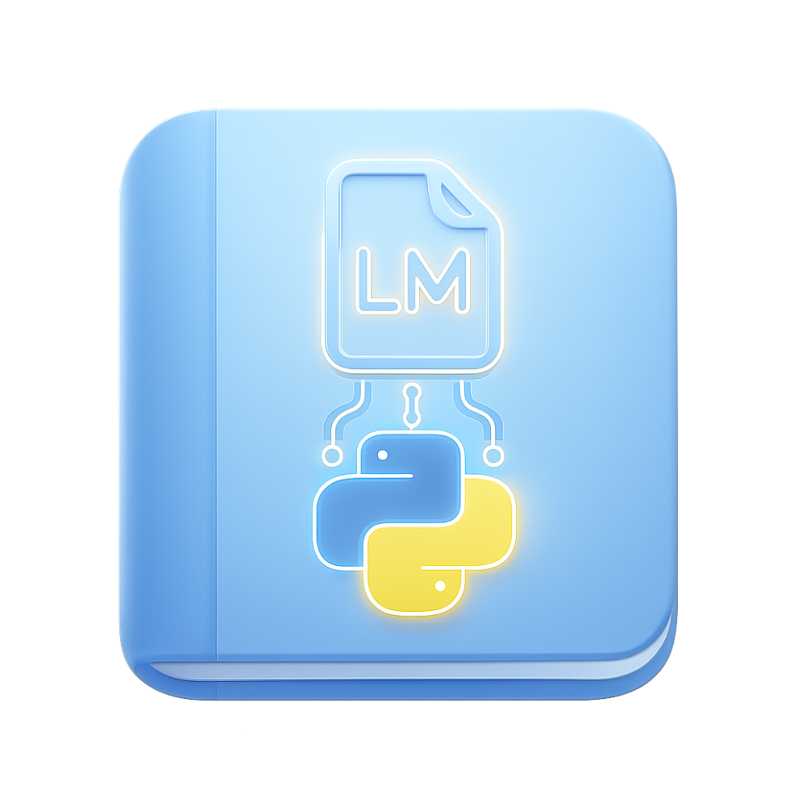
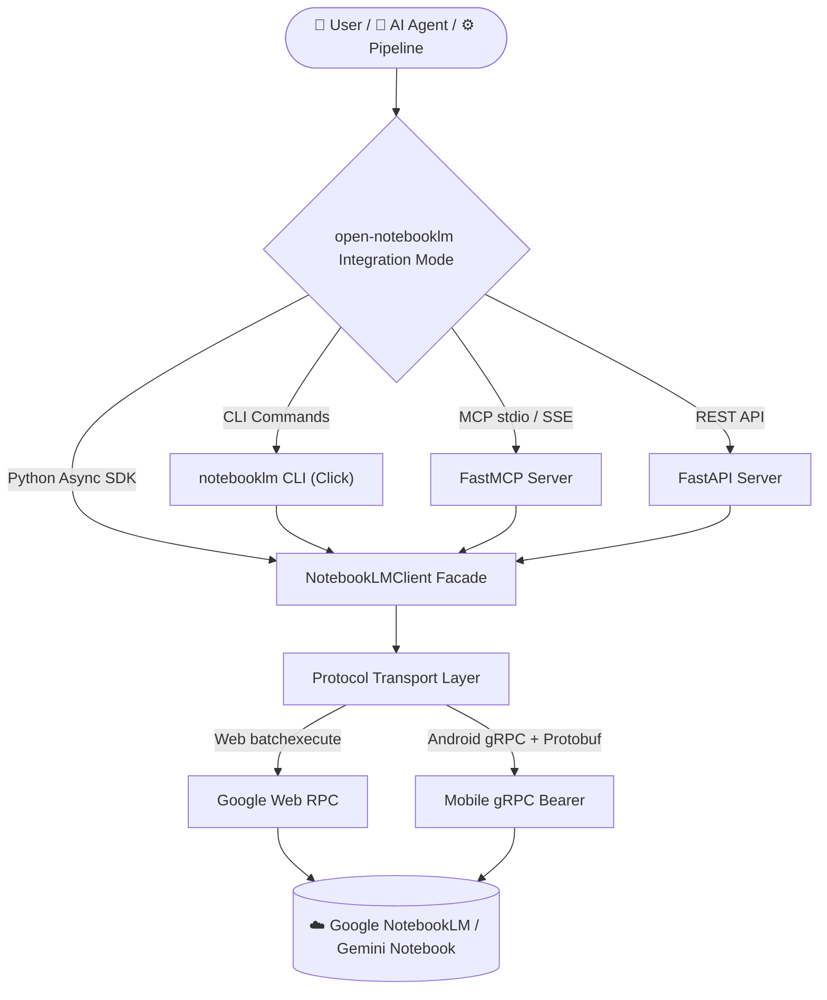

# 🚀 open-notebooklm — Unofficial Google NotebookLM API, Python SDK, CLI & MCP Server for Gemini Notebook Automation

<p align="center">
  
</p>

<h3 align="center">
  The #1 Open-Source Google NotebookLM API, Python SDK, CLI & MCP Server<br>
  for Gemini Notebook Automation, Agentic RAG & Content Generation
</h3>

<p align="center">
  <em>Automate Google NotebookLM · Generate AI podcasts, videos & slides · Agentic RAG & LLM memory · Zero-token knowledge synthesis</em>
</p>

<p align="center">
  <a href="https://pypi.org/project/notebooklm-py/"></a>
  <a href="https://pypi.org/project/notebooklm-py/"></a>
  <a href="https://opensource.org/licenses/MIT"></a>
  <a href="https://github.com/ishandutta2007/open-notebooklm/stargazers"></a>
  <a href="https://pepy.tech/project/notebooklm-py"></a>
  <a href="https://modelcontextprotocol.io"></a>
</p>

<p align="center">
  <a href="#-installation--quick-start">Install</a> · <a href="#-cli-workflow-cheat-sheet">CLI Cheat Sheet</a> · <a href="#-python-sdk">Python SDK</a> · <a href="#-mcp--ai-agent-integration">MCP & Agents</a> · <a href="docs/cli-reference.md">Full CLI Docs</a> · <a href="docs/python-api.md">API Reference</a>
</p>

---

> ⚠️ **Unofficial & Community-Driven** — **open-notebooklm** is **not affiliated with, endorsed by, or maintained by Google**. It provides an unofficial API wrapper for Google NotebookLM (Gemini Notebook) using reverse-engineered web and mobile endpoints. Best for prototypes, research, personal projects, and AI agent workflows. See [Troubleshooting](docs/troubleshooting.md) for debugging tips.

> ℹ️ **Gemini Notebook Rebrand (July 2026):** Google rebranded **NotebookLM** → **[Gemini Notebook](https://blog.google/innovation-and-ai/products/gemini-notebook/notebooklm-gemini-notebook/)**. Same product, same API surface — **open-notebooklm** works seamlessly with both Google NotebookLM and Gemini Notebook.

---

## 📑 Table of Contents

- [🌟 Why open-notebooklm?](#-why-open-notebooklm)
- [✨ Feature Matrix](#-feature-matrix)
  - [📂 Notebook & Source Management](#-notebook--source-management)
  - [🎙️ Content Generation & Studio Artifacts (Audio, Video, Slides, Quizzes)](#️-content-generation--studio-artifacts-audio-video-slides-quizzes)
  - [🔮 Beyond the Web UI](#-beyond-the-web-ui)
- [📊 Google NotebookLM Pricing & Account Tiers](#-google-notebooklm-pricing--account-tiers)
- [🏗️ Architecture & Integration Modes (Python SDK, CLI, MCP Server, REST API)](#️-architecture--integration-modes-python-sdk-cli-mcp-server-rest-api)
- [📦 Installation & Quick Start](#-installation--quick-start)
  - [🖥️ CLI Setup](#️-cli-setup)
  - [🔐 Authentication & Access](#-authentication--access)
  - [🐍 Python SDK (Async Client)](#-python-sdk-async-client)
  - [🔌 MCP & AI Agent Integration (Claude, Codex, Antigravity)](#-mcp--ai-agent-integration-claude-codex-antigravity)
- [⌨️ CLI Workflow Cheat Sheet](#️-cli-workflow-cheat-sheet)
- [💡 Use Cases & Recipes — What People Build with open-notebooklm](#-use-cases--recipes--what-people-build-with-open-notebooklm)
- [🔍 Key Capabilities & Search Terms](#-key-capabilities--search-terms)
- [📚 Documentation Index](#-documentation-index)
- [📜 License](#-license)

---

## 🌟 Why open-notebooklm?

Google NotebookLM (Gemini Notebook) is a **grounded** AI engine: Gemini reads *your* sources and answers with citations. The winning pattern is to let it handle the expensive reasoning while your agent orchestrates the workflow — using NotebookLM as a **zero-token synthesis + memory layer** your agent drives in a loop, pulling structured artifacts **out** in bulk.

**open-notebooklm** is the toolkit that makes this possible:

| What you get | How it helps |
|---|---|
| ⚡ **Async Python SDK** | Modern, fully typed async client (`NotebookLMClient`) with context managers, rich error taxonomy, and 11 typed namespaces. |
| 💻 **Production CLI** | 50+ Click subcommands with `--json` output for agent consumption, `--prompt-file` for long prompts, and structured error envelopes. |
| 🔌 **MCP Server** | stdio + SSE transports for Claude Desktop, Claude Code, Codex, Antigravity, and ChatGPT — local or self-hosted remote behind Cloudflare/Tailscale. |
| 🌐 **REST Server** | FastAPI localhost server for automation without spawning a CLI process per call. |
| 🤖 **Agent Skills** | Bundled [SKILL.md](SKILL.md) + [AGENTS.md](AGENTS.md) for instant Claude Code / Codex / Antigravity tool-use. One-click install via `notebooklm skill install` or `npx skills add`. |
| 📱 **Dual Transport** | Web (`batchexecute`) + Android (gRPC/Protobuf) backends — choose per-command or globally. |

**New to open-notebooklm?** Start with a walkthrough: 🎬 [Claude Code + NotebookLM = CHEAT CODE (video)](https://www.youtube.com/watch?v=usTeU4Uh0iM) · 📝 [5 demos + 50 use cases, with prompts](https://aiblewmymind.substack.com/p/notebooklm-claude-code-use-cases).

---

## ✨ Feature Matrix

### 📂 Notebook & Source Management

| Category | Capabilities |
|---|---|
| **Notebooks** | Create, copy (including sources & Studio artifacts), list, rename, delete |
| **Sources** | URLs, YouTube, files (PDF, text, Markdown, Word, EPUB, audio, video, images), Google Drive, pasted text; refresh, get source guide / fulltext |
| **Chat** | Grounded Q&A with inline source citations, conversation history, custom system personas, suggested starter prompts |
| **Notes** | Create, list, rename, delete, save chat answers as notes, save full conversation history to notes |
| **Source Labels** | AI-generated or manual topic labels; add/remove source membership; filter sources by label |
| **Research** | Web & Drive research agents (fast / deep modes) with auto-import of discovered sources |
| **Sharing** | Public/private links, user permissions (viewer/editor), view-level control |

### 🎙️ Content Generation & Studio Artifacts (Audio, Video, Slides, Quizzes)

Every artifact type the NotebookLM Studio supports, exposed programmatically by **open-notebooklm**:

| Artifact Type | Generation Options | Export / Download Formats |
|---|---|---|
| 🎙️ **Audio Overview (Podcast)** | 4 formats (deep-dive · brief · critique · debate), 3 lengths, 50+ languages | MP3, M4A |
| 🎬 **Video Overview** | 4 formats (explainer · brief · cinematic · short), 8 visual styles + auto/custom, dedicated `cinematic-video` alias | MP4 |
| 📊 **Slide Deck** | Detailed or presenter format, adjustable length, individual slide revision via natural language | PDF, PPTX |
| 🖼️ **Infographic** | 3 orientations (landscape · portrait · square), 3 detail levels | PNG |
| ❓ **Quiz** | Configurable quantity and difficulty | JSON, Markdown, HTML |
| 🃏 **Flashcards** | Configurable quantity and difficulty | JSON, Markdown, HTML |
| 📝 **Report** | Briefing doc, study guide, blog post, or fully custom prompt | Markdown |
| 📋 **Data Table** | Custom structure via natural language | CSV |
| 🧠 **Mind Map** | Two kinds: interactive studio map (default) or note-backed JSON tree (`--kind note-backed` / `MindMapKind`) | JSON |

### 🔮 Beyond the Web UI

Programmatic, batch, and local-file capabilities that **open-notebooklm** makes easy — features the web app doesn't offer:

- 📦 **Batch downloads** — Download all artifacts of a type at once (`download <type> --all`)
- 📝 **Quiz & flashcard export** — Structured JSON, Markdown, or HTML (straight into Anki)
- 🧠 **Mind map data extraction** — Hierarchical JSON for visualization tools
- 📊 **Data table CSV export** — Download structured tables as spreadsheets
- 📑 **Slide deck as PPTX** — Download editable PowerPoint, not just PDF
- ✏️ **Slide revision** — Modify individual slides with natural-language prompts
- 📄 **Report template customization** — Append extra instructions to built-in format templates
- 💬 **Save full chat history to notes** — Persist a complete Q&A conversation (not just a single answer)
- 📖 **Source fulltext access** — Retrieve the indexed text content of any source
- 🔗 **Programmatic sharing** — Manage permissions without touching the UI

---

## 📊 Google NotebookLM Pricing & Account Tiers

**open-notebooklm** adapts to your Google account tier's quotas automatically:

| Service Tier | Pricing | Free Tier Limits | Sources / Notebook | Generation Limits |
|---|---|---|---|---|
| **Standard Google Account** | **Free ($0 / mo)** | ✅ **Free forever** · 100 notebooks · 50 sources/notebook · 500k words/source | 50 | Standard rate limits |
| **Google Workspace / Education** | Included in Workspace plans | ✅ Free trial available | 50 | Elevated enterprise quotas |
| **Gemini Advanced (Google One AI Premium)** | **~$19.99 / mo** | 🆓 1-month free trial | Priority processing | Higher concurrency & throughput |

---

## 🏗️ Architecture & Integration Modes (Python SDK, CLI, MCP Server, REST API)



| Integration Mode | Best For |
|---|---|
| 🐍 **Python API** | Application embedding, async workflows, custom pipelines |
| 💻 **CLI** | Shell scripts, cron jobs, CI/CD automation, quick tasks |
| 🔌 **MCP Server** | Claude Desktop / Claude Code / Codex / Antigravity — local stdio or remote via Cloudflare/Tailscale tunnel (reachable from claude.ai mobile & ChatGPT) |
| 🌐 **REST Server** | High-throughput local automation without subprocess overhead |
| 🤖 **Agent Skills** | Claude Code, Codex, Antigravity — natural language orchestration via bundled SKILL.md |

### 📱 Android Backend

The default transport is the Web (`batchexecute`) protocol. **open-notebooklm** also ships an opt-in **Android backend** using NotebookLM's mobile gRPC service with master-token bearer auth — no browser cookies needed:

```bash
pip install "notebooklm-py[android,browser]"
notebooklm login --master-token --account you@example.com
notebooklm --backend android list --json
```

All 11 public API namespaces are available on the Android transport. See the [Android Backend Guide](docs/android/README.md) for protocol details.

---

## 📦 Installation & Quick Start

> 📘 Full install guide (6 personas, extras matrix, platform notes): **[docs/installation.md](docs/installation.md)**

### 🖥️ CLI Setup

```bash
# Recommended: isolated install via uv tool (or pipx)
uv tool install "notebooklm-py[browser]"

# Authenticate (opens Chromium for Google sign-in)
notebooklm login

# Verify — expect {"status": "ok"}
notebooklm auth check --test --json
```

> 💡 **Why `uv tool` / `pipx`?** They install `notebooklm` into its own isolated environment on your `PATH` — no dependency clashes, one-line upgrade (`uv tool upgrade notebooklm-py`), and they work on modern macOS / Debian / Ubuntu where system-wide `pip install` is blocked ([PEP 668](https://peps.python.org/pep-0668/)). No `uv` yet? `curl -LsSf https://astral.sh/uv/install.sh | sh`.

**Prefer plain `pip`?** Works fine inside a virtualenv:

```bash
python3 -m venv .venv && source .venv/bin/activate   # Windows: .venv\Scripts\activate
pip install "notebooklm-py[browser]"
```

**As a library** (no Playwright, no Chromium):

```bash
pip install notebooklm-py
```

### 🔐 Authentication & Access

**open-notebooklm** supports flexible auth for local dev, headless servers, and multi-tenant setups:

| Auth Method | Command | Use Case |
|---|---|---|
| 🌐 **Interactive Playwright login** (default) | `notebooklm login` | Local development, first-time setup |
| 🍪 **Import browser cookies** (no Playwright needed) | `notebooklm login --browser-cookies chrome` | Reuse an already-signed-in Chrome/Edge session |
| 🔑 **Master-token auth** (headless, self-healing) | `notebooklm login --master-token --account you@example.com` | Servers, CI/CD, remote MCP connector — mints fresh cookies on demand |
| 👥 **Multi-account profiles** | `notebooklm profile switch work` | Switch between Google accounts without re-auth |

### 🐍 Python SDK (Async Client)

```python
import asyncio
from notebooklm import NotebookLMClient, MindMapKind


async def main():
    async with NotebookLMClient.from_storage() as client:
        # Create notebook & attach sources
        nb = await client.notebooks.create("Research")
        await client.sources.add_url(nb.id, "https://example.com", wait=True)

        # Grounded Q&A with citations
        result = await client.chat.ask(nb.id, "Summarize the key findings")
        print(result.answer)

        # Generate podcast + quiz + mind map
        audio = await client.artifacts.generate_audio(nb.id, instructions="make it fun")
        await client.artifacts.wait_for_completion(nb.id, audio.task_id)
        await client.artifacts.download_audio(nb.id, "podcast.m4a")

        quiz = await client.artifacts.generate_quiz(nb.id)
        await client.artifacts.wait_for_completion(nb.id, quiz.task_id)
        await client.artifacts.download_quiz(nb.id, "quiz.json", output_format="json")

        mm = await client.mind_maps.generate(nb.id, kind=MindMapKind.INTERACTIVE)
        await client.artifacts.download_mind_map(nb.id, "mindmap.json", mm.id)


asyncio.run(main())
```

### 🔌 MCP & AI Agent Integration (Claude, Codex, Antigravity)

Connect **open-notebooklm** to Claude Code, Codex, Antigravity, or Claude Desktop:

**One-click agent skill install:**
```bash
notebooklm skill install              # → ~/.claude/skills/notebooklm + ~/.agents/skills/notebooklm
npx skills add ishandutta2007/open-notebooklm  # via open skills registry
```

**Claude Desktop MCP config** (`claude_desktop_config.json`):
```json
{
  "mcpServers": {
    "open-notebooklm": {
      "command": "uv",
      "args": ["tool", "run", "notebooklm", "mcp"]
    }
  }
}
```

**Remote MCP server** (reachable from claude.ai mobile / ChatGPT):
```bash
# Self-host behind Cloudflare/Tailscale tunnel
notebooklm mcp --transport sse --host 0.0.0.0 --port 8080
```

---

## ⌨️ CLI Workflow Cheat Sheet

<p align="center">
  <a href="https://asciinema.org/a/767284" target="_blank"></a>
  <br>
  <em>16-minute open-notebooklm session compressed to 30 seconds</em>
</p>

### Core Workflow

```bash
# 🔐 Authenticate
notebooklm login
notebooklm login --browser msedge                    # Edge SSO
notebooklm login --browser-cookies 'chrome::Profile 1'  # import cookies

# 📓 Create & select notebook
notebooklm create "My Research"
notebooklm use <notebook_id>

# 📥 Add sources (URLs, files, YouTube, Drive)
notebooklm source add "https://en.wikipedia.org/wiki/Artificial_intelligence"
notebooklm source add "./paper.pdf"
notebooklm source add-research "AI safety" --import-all  # deep web research

# 💬 Chat with grounded citations
notebooklm ask "What are the key themes?"
notebooklm ask --prompt-file ./long_question.txt

# 🎙️ Generate all artifact types
notebooklm generate audio "make it engaging" --wait
notebooklm generate video --style whiteboard --wait
notebooklm generate cinematic-video "documentary-style" --wait
notebooklm generate quiz --difficulty hard
notebooklm generate flashcards --quantity more
notebooklm generate slide-deck
notebooklm generate infographic --orientation portrait
notebooklm generate mind-map
notebooklm generate data-table "compare key concepts"
notebooklm generate report --format briefing-doc --wait

# 📥 Download everything
notebooklm download audio ./podcast.m4a
notebooklm download video ./overview.mp4
notebooklm download quiz --format markdown ./quiz.md
notebooklm download flashcards --format json ./cards.json
notebooklm download slide-deck ./slides.pptx
notebooklm download infographic ./infographic.png
notebooklm download mind-map ./mindmap.json
notebooklm download data-table ./data.csv
```

### Utility Commands

```bash
notebooklm auth check --test              # diagnose auth issues
notebooklm auth refresh --quiet            # cookie keepalive (cron/systemd)
notebooklm metadata --json                 # export notebook metadata
notebooklm share status                    # inspect sharing state
notebooklm language list                   # 50+ supported languages
notebooklm profile list                    # list Google account profiles
notebooklm skill status                    # check agent skill installation
notebooklm agent show codex                # print bundled Codex instructions
```

---

## 💡 Use Cases & Recipes — What People Build with open-notebooklm

### 🪙 Spend Fewer Tokens — Let NotebookLM Do the Expensive Thinking

- **Zero-token research offload** — Throw 30 documents into a notebook, let Gemini do the heavy analysis, your agent spends tokens only on the final polish. The agent just orchestrates (`create` → `source add` → `ask`); reasoning happens server-side. *In the wild: [a four-workflow guide to stop Claude Code burning tokens](https://x.com/hooeem/status/2042293751805329445).*

- **🧠 Knowledge distillation → a permanent skill** — Run Deep Research (`source add-research "topic" --mode deep`), let NotebookLM condense a doc corpus, bake the result into a `SKILL.md` your agent loads at startup — **build once, reuse with zero runtime tokens**, git-versioned and immune to UI drift.

- **✅ Self-validating skills** — Have NotebookLM generate the *eval set* (a quiz from your sources) to grade an agent skill against ground truth. *In the wild: [a skill that scored 4/10 → 10/10 after one iteration, graded by a NotebookLM-generated quiz](https://x.com/nurijanian/status/2037136490157986277).*

### 💾 Give Your Agent Memory — Persistent, Grounded Recall

- **Persistent cross-session memory** — Keep a "Master Brain" notebook; a wrap-up step appends each session's decisions as notes, and your `CLAUDE.md` queries it at session start. Storage lives on Google's infrastructure.

- **🧩 Grounded memory for coding agents** — Expose internal docs/RFCs/architecture via the [MCP server](docs/mcp-guide.md) so your agent answers from *your* code with citations — a zero-infra alternative to a custom vector DB. *In the wild: [turning a notebook into a "project brain" a coding agent consults](https://medium.com/@pradeep00271/every-software-project-needs-a-project-brain-5cbc33917160).*

- **🪞 Query your own notes / journal** — Load years of daily notes and `ask` for cited answers across your history. *In the wild: [chatting with a year of daily notes](https://artemxtech.substack.com/p/notebooklm-has-a-knowledge-graph).*

### 🎙️ Turn Sources into Artifacts — Cited Responses, Media & Exports

- **📞 Grounded knowledge base / RAG oracle** — Load product docs & FAQs, then `ask --json` for source-grounded answers for support or on-call. *In the wild: [OpenClaw scraped 524 pages, deduped to 269 clean sources](https://x.com/onenewbite/status/2024819940327379286).*

- **🔁 Multi-format content repurposing** — One source set → podcast + video + slide deck + quiz + flashcards + blog draft. Fan a single notebook across channels.

- **🕸️ Obsidian / knowledge-graph sync** — CLI downloads land as files in your vault; community skills even resolve NotebookLM citation markers into `[[wikilinks]]`. *In the wild: ["Claude Code + NotebookLM + Obsidian = GOD MODE"](https://www.youtube.com/watch?v=kU3qYQ7ACMA).*

### ⚙️ Run It Unattended, at Scale, or on the Go

- **🚨 Incident runbook generator** — On alert → spin up a notebook → load docs → `generate report --format briefing-doc` → automated runbook.
- **📚 Curriculum builder** — One notebook per topic → bulk-generate podcasts, quizzes, and flashcards.
- **📰 Scheduled audio briefings** — `auth refresh --quiet` (cron) + `generate audio` → fresh daily podcast feed.
- **📱 NotebookLM from your phone** — Self-host the [remote MCP connector](docs/mcp-guide.md#remote-deployment-docker--a-tunnel) behind a tunnel → drive **open-notebooklm** from the claude.ai mobile app. *No app-hopping required.*

---

## 🔍 Key Capabilities & Search Terms

If you are looking for any of the following solutions, **open-notebooklm** provides a drop-in implementation:

- **NotebookLM Python API & SDK**: Full async client (`NotebookLMClient`) for creating notebooks, uploading PDFs/URLs/YouTube videos, running grounded chats, and downloading generated audio/video.
- **NotebookLM CLI**: Command-line tool to automate Google NotebookLM pipelines, batch operations, shell scripting, and cron tasks.
- **Model Context Protocol (MCP) Server**: Official MCP stdio/SSE server connecting NotebookLM as a grounded knowledge and long-term memory layer for Claude Desktop, Claude Code, OpenAI Codex, Antigravity, and Cursor.
- **AI Agent Memory & Zero-Token RAG**: Grounded retrieval-augmented generation where Gemini handles dense source reasoning at zero API token cost while returning inline citations.
- **Programmatic Audio / Podcast Generation**: Automate generation and batch download of Google NotebookLM Deep Dive audio discussions in 50+ languages.
- **Video Overviews, Slide Decks & Quizzes**: Automated extraction of studio artifacts including video presentations, PowerPoint (`.pptx`), mind maps, flashcards, and Anki-compatible quiz exports.
- **Gemini Notebook Automation**: 100% compatible with Google's rebranded Gemini Notebook ecosystem across Web RPC (`batchexecute`) and mobile Android gRPC transports.

---

## 📚 Documentation Index

### 📘 User Guides

| Doc | Description |
|---|---|
| 📖 **[Installation Guide](docs/installation.md)** | 6 personas, extras matrix, platform notes, deployment setup |
| 💻 **[CLI Reference](docs/cli-reference.md)** | Complete command documentation for all 50+ subcommands |
| 🐍 **[Python API Reference](docs/python-api.md)** | Full async client reference — classes, methods, types |
| 🔌 **[MCP Server Guide](docs/mcp-guide.md)** | stdio + SSE transports, tool reference, remote deployment |
| 📱 **[Android Backend Guide](docs/android/README.md)** | Mobile gRPC setup, master-token credentials, protocol notes |
| ⚙️ **[Configuration](docs/configuration.md)** | Storage paths, profiles, environment variables |
| 📊 **[Quota & Tier Limits](docs/quota-limits.md)** | Per-tier notebook/source/studio limits |
| 🛠️ **[Troubleshooting](docs/troubleshooting.md)** | Auth issues, rate limits, common errors |
| 🔒 **[Credential Security](docs/security.md)** | Secret handling and trust boundaries |
| 📐 **[API Stability](docs/stability.md)** | Versioning policy and stability guarantees |
| 🔄 **[Upgrading to v0.8.0](docs/upgrading-to-0.8.0.md)** | Breaking-change migration guide |

### 🛠️ Contributor Guides

| Doc | Description |
|---|---|
| 🏛️ **[Architecture](docs/architecture.md)** | System overview and design principles |
| 🧪 **[Development Guide](docs/development.md)** | Testing, linting, and releasing |
| 🔬 **[RPC Development](docs/rpc-development.md)** | Protocol capture and debugging |
| 📡 **[RPC Reference](docs/rpc-reference.md)** | Payload structures |
| 📋 **[Changelog](CHANGELOG.md)** | Version history and release notes |
| 🔐 **[Security Policy](SECURITY.md)** | Vulnerability reporting |
| 🤝 **[Contributing](CONTRIBUTING.md)** | How to contribute, run tests, format code |

---

## 📜 License

**open-notebooklm** is distributed under the **MIT License**. See [`LICENSE`](LICENSE) for complete terms.

---

<p align="center">
  <strong>⭐ If open-notebooklm saves you time, consider starring the repo — it helps others discover the project!</strong>
</p>
