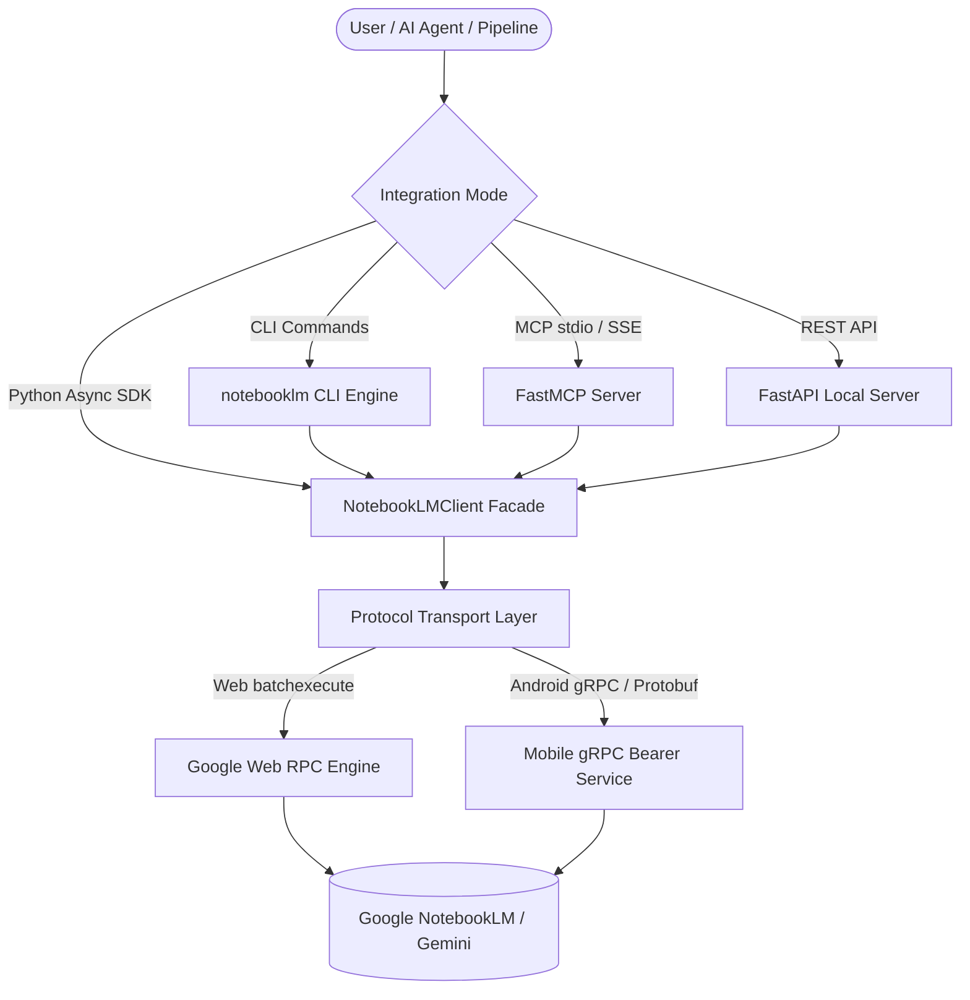

# 🚀 open-notebooklm

<p align="center">
  
</p>

<p align="center">
  <strong>The Ultimate Open-Source Google NotebookLM & Gemini Notebook Python SDK, CLI, MCP Server & AI Agent Toolkit</strong>
</p>

<p align="center">
  <a href="https://pypi.org/project/notebooklm-py/"></a>
  <a href="https://pypi.org/project/notebooklm-py/"></a>
  <a href="https://opensource.org/licenses/MIT"></a>
  <a href="https://github.com/ishandutta2007/open-notebooklm"></a>
</p>

---

## 🌟 Overview

**open-notebooklm** is a comprehensive, production-ready ecosystem for automating **Google NotebookLM** (now **Gemini Notebook**). Unlock full programmatic power over your notebooks, multimodal sources, grounding citations, and studio generation tools via:

- ⚡ **Async Python API** – Modern, fully typed async client with context managers and error taxonomy.
- 💻 **Feature-Packed CLI** – Scriptable Click-based command suite with structured JSON outputs.
- 🔌 **Model Context Protocol (MCP) Server** – Direct integration with Claude Desktop, Claude Code, Codex, Antigravity, and OpenClaw.
- 🤖 **Zero-Token AI Agent Synthesis** – Grounded RAG memory layer to offload expensive context reasoning to NotebookLM.
- 🎙️ **Multimodal Studio Artifact Generator** – Audio Overviews (podcasts), video explainer summaries, slide decks (PPTX/PDF), quizzes, flashcards, mind maps, and interactive data tables.

> ℹ️ **Google Rebranding Note:** Google rebranded **NotebookLM** to **[Gemini Notebook](https://blog.google/innovation-and-ai/products/gemini-notebook/notebooklm-gemini-notebook/)**. This open-source toolkit seamlessly communicates with the underlying backend and supports both Web (`batchexecute`) and Android gRPC protocols.

---

## 📑 Table of Contents

- [✨ Key Features](#-key-features)
- [📊 Account Tiers & Pricing Limits](#-account-tiers--pricing-limits)
- [🏗️ System Architecture & Interfaces](#️-system-architecture--interfaces)
- [📦 Installation & Quick Start](#-installation--quick-start)
  - [CLI Setup](#-cli-setup)
  - [Python SDK Setup](#-python-sdk-setup)
  - [MCP & Agent Setup](#-mcp--agent-setup)
- [💡 Real-World Use Cases & Recipes](#-real-world-use-cases--recipes)
- [📚 Documentation Index](#-documentation-index)
- [🛡️ Security & Disclaimers](#️-security-disclaimers)
- [📜 License](#-license)

---

## ✨ Key Features

| Domain | Capability Highlights |
|---|---|
| 📂 **Notebook Management** | Create, duplicate (including Studio artifacts & sources), rename, list, and delete notebooks. |
| 📥 **Multimodal Ingestion** | Bulk import PDFs, text, Markdown, Word, EPUB, audio, video, images, YouTube URLs, web URLs, and Google Drive files. |
| 💬 **Cited Chat & Grounding** | Precise question-answering with inline source citations, customizable system personas, and chat-history-to-notes persistence. |
| 🎙️ **Audio Overviews (Podcasts)** | Generate 2-host audio podcasts (deep-dive, brief, critique, debate) with 50+ language options and direct MP3/M4A download. |
| 🎬 **Video Overviews** | Generate cinematic explainer videos across 8 visual styles with full MP4 local export. |
| 📊 **Slide Decks & Presentations** | Generate detailed or presenter-style decks with natural language slide revision and PDF/PPTX export. |
| 🧠 **Mind Maps & Study Sets** | Extract hierarchical JSON mind map trees, interactive studio mind maps, quizzes, flashcards, and CSV data tables. |
| 🔍 **Autonomous Deep Research** | Launch automated web and Google Drive research sweeps that autonomously collect and attach relevant sources. |

---

## 📊 Account Tiers & Pricing Limits

Google NotebookLM is available across free and paid account tiers. **open-notebooklm** adapts to your tier's quotas automatically:

| Service Tier | Pricing | Free Tier Availability & Limits | Source Capacity | Daily Generation Limits |
|---|---|---|---|---|
| **Standard Google Account** | **Free ($0 / mo)** | **Yes (Free Forever)**<br>• Up to 100 notebooks<br>• Up to 50 sources per notebook<br>• 500k words (~200MB) per source | 50 sources / notebook | Standard rate limits apply |
| **Google Workspace / Education** | Included with Workspace subscription | **Free Trial available** via Workspace plans | Up to 50 sources / notebook | Elevated enterprise quotas |
| **Gemini Advanced / Google One AI Premium** | ~$19.99 / mo | **1-Month Free Trial** | Priority processing & larger context windows | Higher concurrency & audio generation throughput |

---

## 🏗️ System Architecture & Interfaces



---

## 📦 Installation & Quick Start

### 🖥️ CLI Setup

Install the CLI in an isolated environment using `uv tool` or `pipx`:

```bash
# Recommended installation with browser automation support
uv tool install "notebooklm-py[browser]"

# Authenticate with your Google account
notebooklm login

# Verify connectivity
notebooklm auth check --test --json
```

#### CLI Workflow Example:

```bash
# 1. Create a notebook
notebooklm create "Autonomous AI Systems"
notebooklm use <notebook_id>

# 2. Add sources (URLs, PDFs, docs)
notebooklm source add "https://en.wikipedia.org/wiki/Artificial_intelligence"
notebooklm source add "./research_paper.pdf"

# 3. Ask grounded questions
notebooklm ask "What are the core breakthroughs described in the sources?"

# 4. Generate & download an audio overview podcast
notebooklm generate audio "Focus on the real-world applications" --wait
notebooklm download audio ./podcast_overview.m4a

# 5. Generate interactive study tools
notebooklm generate quiz --difficulty hard
notebooklm download quiz --format markdown ./quiz.md
```

---

### 🐍 Python SDK Setup

Install as a lightweight Python dependency:

```bash
pip install notebooklm-py
```

#### Python Async Example:

```python
import asyncio
from notebooklm import NotebookLMClient, MindMapKind


async def main():
    async with NotebookLMClient.from_storage() as client:
        # 1. Create notebook & attach sources
        notebook = await client.notebooks.create("Machine Learning Deep Dive")
        await client.sources.add_url(
            notebook.id,
            "https://en.wikipedia.org/wiki/Machine_learning",
            wait=True,
        )

        # 2. Query with grounded citations
        response = await client.chat.ask(notebook.id, "Summarize the primary supervised learning methods.")
        print(f"Answer:\n{response.answer}\n")

        # 3. Generate and export a mind map
        mind_map = await client.mind_maps.generate(notebook.id, kind=MindMapKind.INTERACTIVE)
        await client.artifacts.download_mind_map(notebook.id, "mindmap.json", mind_map.id)
        print("Mind map saved to mindmap.json!")


if __name__ == "__main__":
    asyncio.run(main())
```

---

### 🔌 MCP & Agent Setup

Connect **open-notebooklm** directly to Claude Code, Codex, Antigravity, or Claude Desktop:

#### One-Click Agent Skill Install:
```bash
notebooklm skill install
```

#### NPX Skill Registry Discovery:
```bash
npx skills add teng-lin/notebooklm-py
```

#### Claude Desktop Configuration (`claude_desktop_config.json`):
```json
{
  "mcpServers": {
    "notebooklm": {
      "command": "uv",
      "args": ["tool", "run", "notebooklm", "mcp"]
    }
  }
}
```

---

## 💡 Real-World Use Cases & Recipes

- 🪙 **Zero-Token Research Offloading** – Load 50 complex PDF reports into a notebook and have your agent query NotebookLM for distilled synthesis instead of consuming millions of LLM context tokens.
- 💾 **Persistent Grounded Memory for Coding Agents** – Connect your internal codebase documentation and architecture notes via MCP so coding agents answer with verifiable source citations.
- 🎙️ **Automated Podcast & Content Pipelines** – Ingest daily RSS articles or technical releases and automatically output dual-host audio briefings.
- 🕸️ **Obsidian & Second-Brain Sync** – Download reports, structured mind maps, and flashcards directly into your local Markdown knowledge graph.

---

## 📚 Documentation Index

- 📖 **[Installation Guide](docs/installation.md)** – Detailed setup across all environments and platforms.
- 💻 **[CLI Reference](docs/cli-reference.md)** – Comprehensive manual for all CLI subcommands.
- 🐍 **[Python API Reference](docs/python-api.md)** – Complete reference for classes, methods, and types.
- 🔌 **[MCP Server Guide](docs/mcp-guide.md)** – Full guide for stdio and remote MCP server hosting.
- 📱 **[Android Backend Guide](docs/android/README.md)** – Setup for mobile gRPC bearer-token workflows.
- 🏛️ **[Architecture & ADRs](docs/architecture.md)** – Architectural decisions and system contracts.
- 🛠️ **[Troubleshooting & FAQ](docs/troubleshooting.md)** – Solutions for auth, rate limits, and common errors.
- 🤝 **[Contributing Guidelines](CONTRIBUTING.md)** – How to contribute, run tests, and format code.

---

## 🛡️ Security & Disclaimers

> ⚠️ **Disclaimer:** This is an independent, community-driven open-source project and is **not affiliated with, maintained by, or endorsed by Google**. Google NotebookLM and Gemini are registered trademarks of Google LLC. This library relies on undocumented endpoints that are subject to change.

---

## 📜 License

Distributed under the **MIT License**. See [`LICENSE`](LICENSE) for complete terms.
